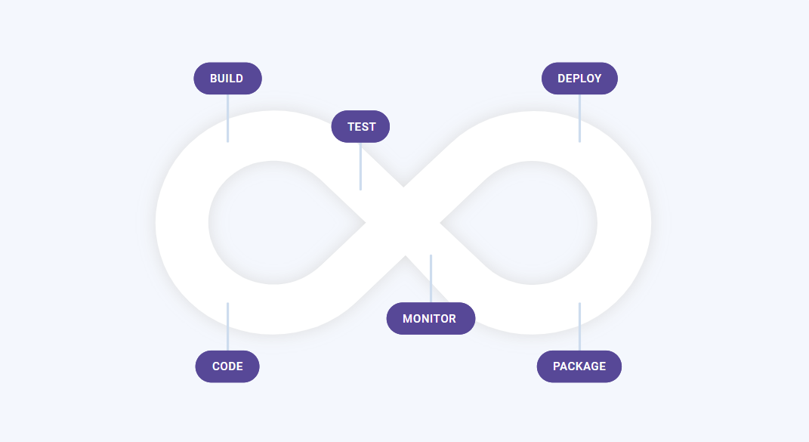

# Automation and Testing

## [Katalon Studio](https://www.katalon.com)

[Katalon Studio](https://www.katalon.com/?utm_source=toolsqa&utm_medium=article&utm_campaign=toolsqa) is a comprehensive toolset for web and mobile app automation testing. This tool includes a full package of powerful features that help overcome common challenges in web UI test automation, for example, pop-up, iframe, and wait-time. This user-friendly and versatile solution help testers test better, work faster, and launch high-quality software thank the intelligence it provides to the entire test automation process.

The tool is available to all testers at no cost and can be downloaded at [https://www.katalon.com](https://www.katalon.com/?utm_source=toolsqa&utm_medium=article&utm_campaign=toolsqa)



## Enhance Your Automated Tests _**-**_ [_**SpeckFlow**_](https://specflow.org/)

### The Free & Open Source BDD-Framework for .NET

[https://specflow.org/](https://specflow.org/)

### What Can Be Tested?

With SpecFlow your options are open.

<table>
  <thead>
    <tr>
      <th style="text-align:left">
        
Web/UI-Testing

        
Test your automated browser-tests written using Selenium

      </th>
      <th style="text-align:left"></th>
    </tr>
  </thead>
  <tbody>
    <tr>
      <td style="text-align:left">
        
E2E business process testing

        
WebUI &#x2192; API &#x2192; WebUI &#x2192; DB

      </td>
      <td style="text-align:left"></td>
    </tr>
    <tr>
      <td style="text-align:left">
        
API Automation

        
REST web services

      </td>
      <td style="text-align:left"></td>
    </tr>
    <tr>
      <td style="text-align:left">
        
Mobile Automation

        
iOS, Android Nate, hybrid and mobile web apps.

      </td>
      <td style="text-align:left"></td>
    </tr>
    <tr>
      <td style="text-align:left">
        
Desktop Automation

        
WPF, WinForms and Universal applications

      </td>
      <td style="text-align:left"></td>
    </tr>
  </tbody>
</table>

### SpecFlow Is Part of Your CI/CD-Process

[Autify, AI-powered software testing automation platform](https://autify.com/)

## Effortless no code testing for everyone

Simply interact with your browser



2 weeks free trials

### Trial

2 weeks free trials

* This is for everyone who wants to work on automating E2E tests using Autify. You can start with Free Trial and gradually expand the functionality of your contract.1,000 runs per month1 ProjectChrome on Autify cloudRun 10 parallels on Autify cloudEmail testingOnline Chat Support [Start a free trial](https://autify.typeform.com/to/DkDEvc)

### Contact Us

* This is for those who are actively automating software testing and have more than one application. You can use Autify by combining various necessary functions to your plan to meet your needs.Custom runs per monthCustom projectsMajor PC browsers on real devices  \(Chrome, IE, Edge, Firefox, Safari\)Mobile real devices  \(Safari/iOS, Chrome/Android\)Run 10 parallels on Autify cloudCustom parallels on real devicesFixed IP Address guaranteeEmail testingExport the result of test runsTAM Support [Contact Us](https://autify.com/contact)

### What's included

<table>
  <thead>
    <tr>
      <th style="text-align:left"></th>
      <th style="text-align:left">
        

          
        

        
<b>Trial</b>
        

      </th>
      <th style="text-align:left">
        

          
        

        
<b>Contact Us</b>
        

      </th>
    </tr>
  </thead>
  <tbody>
    <tr>
      <td style="text-align:left">Tests run per month</td>
      <td style="text-align:left">1,000 runs</td>
      <td style="text-align:left">Custom runs</td>
    </tr>
    <tr>
      <td style="text-align:left">Log retention</td>
      <td style="text-align:left">30 days</td>
      <td style="text-align:left">Custom</td>
    </tr>
    <tr>
      <td style="text-align:left">Number of Projects</td>
      <td style="text-align:left">1</td>
      <td style="text-align:left">Custom</td>
    </tr>
    <tr>
      <td style="text-align:left">Number of users</td>
      <td style="text-align:left">No limit</td>
      <td style="text-align:left">No limit</td>
    </tr>
    <tr>
      <td style="text-align:left"><b>Cross Browser Testing</b>
      </td>
      <td style="text-align:left"></td>
      <td style="text-align:left"></td>
    </tr>
    <tr>
      <td style="text-align:left">Chrome on Autify cloud</td>
      <td style="text-align:left">
        
      </td>
      <td style="text-align:left">
        
      </td>
    </tr>
    <tr>
      <td style="text-align:left">Mobile Emulator on Autify cloud</td>
      <td style="text-align:left">
        
      </td>
      <td style="text-align:left">
        
      </td>
    </tr>
    <tr>
      <td style="text-align:left">IE 11 on Autify cloud</td>
      <td style="text-align:left"></td>
      <td style="text-align:left">
        
      </td>
    </tr>
    <tr>
      <td style="text-align:left">Chromium Edge on Autify cloud</td>
      <td style="text-align:left"></td>
      <td style="text-align:left">
        
      </td>
    </tr>
    <tr>
      <td style="text-align:left">Major PC browsers on real devices (Chrome, IE, Edge, Firefox, Safari)</td>
      <td
      style="text-align:left"></td>
        <td style="text-align:left">
          
        </td>
    </tr>
    <tr>
      <td style="text-align:left">Mobile real devices (Safari/iOS, Chrome/Android)</td>
      <td style="text-align:left"></td>
      <td style="text-align:left">
        
      </td>
    </tr>
    <tr>
      <td style="text-align:left">Run 10 parallels on Autify cloud</td>
      <td style="text-align:left">
        
      </td>
      <td style="text-align:left">
        
      </td>
    </tr>
    <tr>
      <td style="text-align:left">Number of parallels on real devices</td>
      <td style="text-align:left"></td>
      <td style="text-align:left">Custom</td>
    </tr>
    <tr>
      <td style="text-align:left"><b>Network</b>
      </td>
      <td style="text-align:left"></td>
      <td style="text-align:left"></td>
    </tr>
    <tr>
      <td style="text-align:left">Basic Auth</td>
      <td style="text-align:left">
        
      </td>
      <td style="text-align:left">
        
      </td>
    </tr>
    <tr>
      <td style="text-align:left">Fixed IP Address guarantee</td>
      <td style="text-align:left"></td>
      <td style="text-align:left">
        
      </td>
    </tr>
    <tr>
      <td style="text-align:left">Custom host name</td>
      <td style="text-align:left"></td>
      <td style="text-align:left">
        
      </td>
    </tr>
    <tr>
      <td style="text-align:left"><b>Integrations</b>
      </td>
      <td style="text-align:left"></td>
      <td style="text-align:left"></td>
    </tr>
    <tr>
      <td style="text-align:left">REST API</td>
      <td style="text-align:left">
        
      </td>
      <td style="text-align:left">
        
      </td>
    </tr>
    <tr>
      <td style="text-align:left">Slack integration</td>
      <td style="text-align:left">
        
      </td>
      <td style="text-align:left">
        
      </td>
    </tr>
    <tr>
      <td style="text-align:left">Other integrations</td>
      <td style="text-align:left">
        
      </td>
      <td style="text-align:left">
        
      </td>
    </tr>
    <tr>
      <td style="text-align:left"><b>General Features</b>
      </td>
      <td style="text-align:left"></td>
      <td style="text-align:left"></td>
    </tr>
    <tr>
      <td style="text-align:left">Data Driven testing</td>
      <td style="text-align:left">
        
      </td>
      <td style="text-align:left">
        
      </td>
    </tr>
    <tr>
      <td style="text-align:left">File upload testing</td>
      <td style="text-align:left">
        
      </td>
      <td style="text-align:left">
        
      </td>
    </tr>
    <tr>
      <td style="text-align:left">Email testing</td>
      <td style="text-align:left">
        
      </td>
      <td style="text-align:left">
        
      </td>
    </tr>
    <tr>
      <td style="text-align:left">Export the result of test runs</td>
      <td style="text-align:left"></td>
      <td style="text-align:left">
        
      </td>
    </tr>
    <tr>
      <td style="text-align:left"><b>Support</b>
      </td>
      <td style="text-align:left"></td>
      <td style="text-align:left"></td>
    </tr>
    <tr>
      <td style="text-align:left">Online Chat Support</td>
      <td style="text-align:left">
        
      </td>
      <td style="text-align:left">
        
      </td>
    </tr>
    <tr>
      <td style="text-align:left">TAM Support</td>
      <td style="text-align:left"></td>
      <td style="text-align:left">
        
      </td>
    </tr>
    <tr>
      <td style="text-align:left"><b>Advanced Options</b>
      </td>
      <td style="text-align:left"></td>
      <td style="text-align:left"></td>
    </tr>
    <tr>
      <td style="text-align:left">Security questions</td>
      <td style="text-align:left"></td>
      <td style="text-align:left">
        
      </td>
    </tr>
    <tr>
      <td style="text-align:left">Custom legal terms</td>
      <td style="text-align:left"></td>
      <td style="text-align:left">
        
      </td>
    </tr>
  </tbody>
</table>

